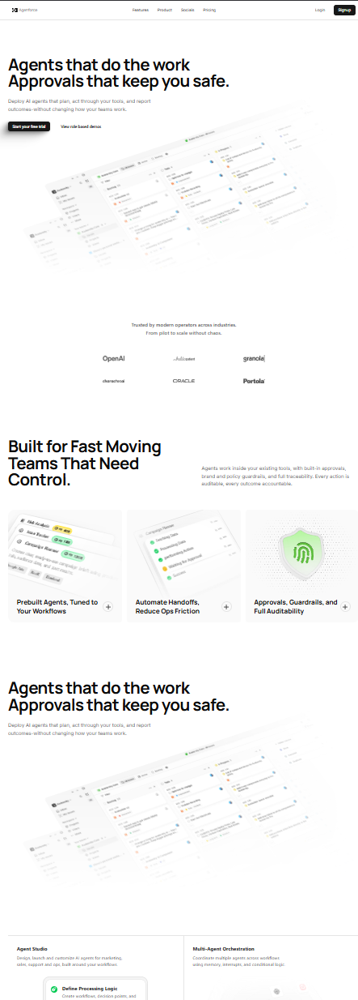

# 🚀 AgentForce

> A modern, responsive marketing landing page template built tightly around Next.js, Framer Motion, and Tailwind CSS.

**Status:** 🚧 Work in Progress (~40% Complete)

This project is a high-quality replica of an **Aceternity UI** template block. It is being built from the ground up by taking inspiration from their design system and tweaking core components to fit custom, modern needs.

## 🛠️ Tech Stack

- **Framework:** Next.js 16 (App Router & Turbopack)
- **Library:** React 19
- **Styling:** Tailwind CSS v4
- **Animations:** Motion (Framer Motion)
- **Icons:** Tabler Icons

## ⚙️ Getting Started

First, install dependencies:

```bash
npm install
```

Then, run the development server locally:

```bash
npm run dev
```

Open [http://localhost:3000](http://localhost:3000) with your browser to see the result. You can start editing the page by modifying `app/page.tsx`.

## 🎨 Reference Design

Here is the design screenshot for the exact Aceternity template block being replicated:

